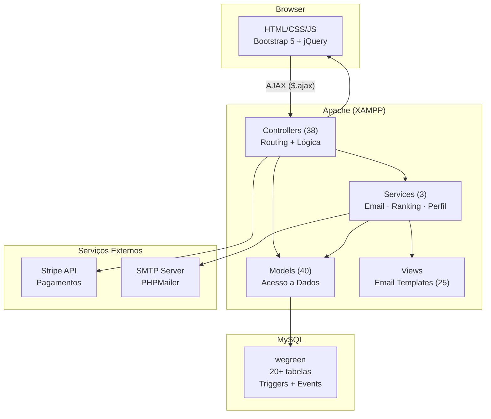
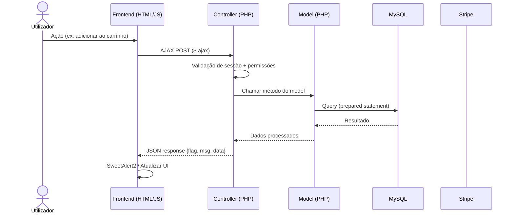
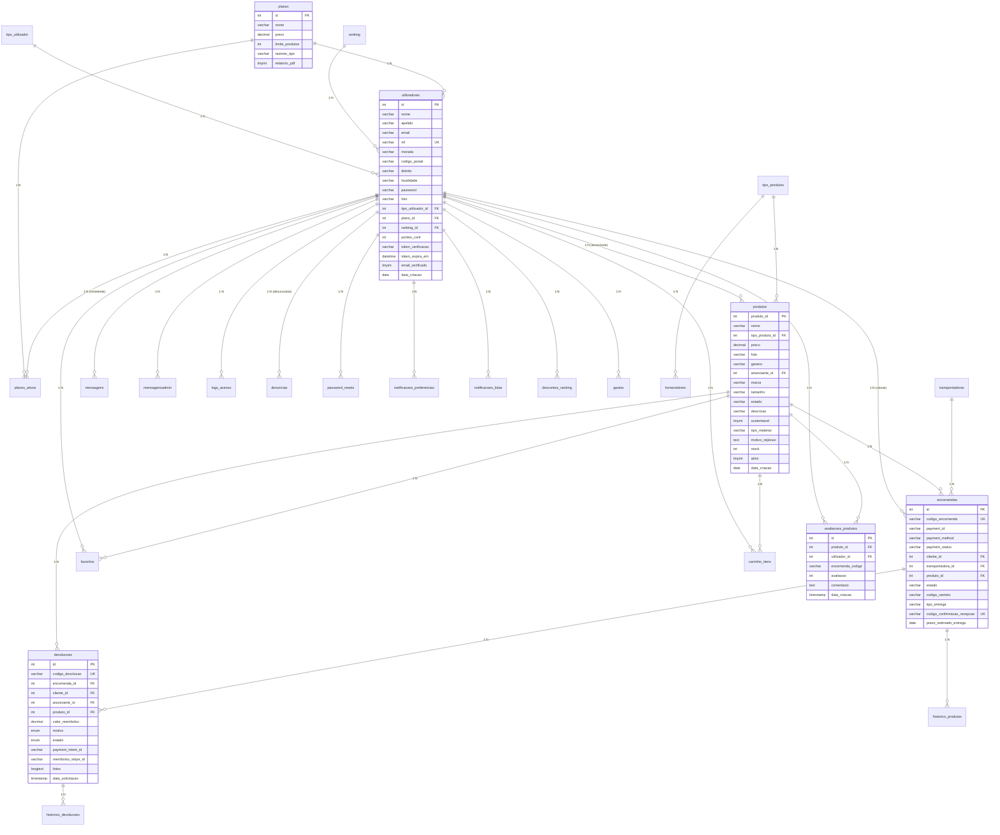

<div align="center">

# WeGreen

### Marketplace de moda sustentável — full-stack, com pagamentos Stripe, sistema de ranking gamificado e notificações transacionais por email

<br>

<p>
  
  
  
  
  
  
  
  
</p>

</div>

---

## Índice

1. [Introdução](#introdução)
2. [Destaques Técnicos](#destaques-técnicos)
3. [Funcionalidades](#funcionalidades)
4. [Arquitetura](#arquitetura)
5. [Modelo de Dados](#modelo-de-dados)
6. [Tech Stack](#tech-stack)
7. [Estrutura do Projeto](#estrutura-do-projeto)
8. [Configuração e Instalação](#configuração-e-instalação)
9. [Segurança](#segurança)
10. [Autor](#autor)

---

## Introdução

**WeGreen** é um marketplace de moda sustentável que conecta designers, artesãos e marcas locais a consumidores conscientes. A plataforma suporta três perfis de utilizador — **Administrador**, **Cliente** e **Anunciante** — cada um com dashboards, permissões e fluxos dedicados.

O projeto vai além de um CRUD genérico: inclui pagamentos reais via Stripe (produtos e planos de subscrição), um sistema de ranking gamificado com pontos de confiança, chat em tempo real entre utilizadores, notificações transacionais por email (25 templates), gestão completa de encomendas e devoluções com máquina de estados, e três dashboards com KPIs e gráficos Chart.js.

---

## Destaques Técnicos

| Dimensão | Detalhe |
|---|---|
| **Páginas/Vistas** | 30+ (landing, marketplace, checkout, dashboards, perfis, chat, planos, gestão) |
| **Modelos de Dados** | 40 models PHP (MVC), 20+ tabelas MySQL com triggers e eventos |
| **Controladores** | 38 controllers com separação clara de responsabilidades |
| **Pagamentos** | Stripe Checkout — produtos (carrinho) e subscrições (planos), com cupões dinâmicos |
| **Email** | 25 templates transacionais via PHPMailer + SMTP (verificação, encomendas, devoluções, ranking) |
| **Autenticação** | Sessões PHP, hash de passwords (bcrypt/Argon2 + MD5 legacy), verificação de email por token |
| **RBAC** | 3 roles com permissões granulares (Admin, Cliente, Anunciante) + perfil duplo |
| **Ranking** | Sistema gamificado com 5 tiers, pontos por vendas/devoluções/avaliações, descontos automáticos |
| **Devoluções** | Máquina de estados completa (7 estados) com triggers MySQL e histórico |
| **Notificações** | Sistema com preferências configuráveis por utilizador e tipo |
| **UI/UX** | Bootstrap 5, SweetAlert2, DataTables, Select2, Chart.js, animações CSS |

---

## Funcionalidades

### Landing Page e Marketplace

Página inicial com hero section em vídeo, value propositions e catálogo de produtos em destaque. O marketplace suporta pesquisa com autocomplete, filtros por categoria/género e paginação. Carrinho persistente com transferência automática de sessão temporária para utilizador autenticado.

---

### Dashboards — KPIs e Gráficos

Três dashboards especializados por role:

| Dashboard | Funcionalidades |
|---|---|
| **Administrador** | Rendimentos, gastos, total de utilizadores, planos ativos, gráfico de vendas/gastos (Chart.js line), top produtos (bar chart), tabela de produtos pendentes de verificação |
| **Anunciante** | Gestão de produtos, encomendas, devoluções, relatórios financeiros, lucros mensais, chat com clientes |
| **Cliente** | Encomendas ativas, favoritos, devoluções, histórico de compras, confirmação de entrega |

---

### Pagamentos — Stripe Checkout

Integração Stripe com dois fluxos:

**Carrinho de compras** — Checkout com line items dinâmicos, suporte a CTT, DPD e entrega domiciliária, cupões de desconto percentuais e múltiplos métodos de pagamento (cartão, PayPal, Klarna).

**Planos de subscrição** — Três tiers para anunciantes com limites de produtos e funcionalidades diferenciadas:

| Plano | Preço | Produtos | Rastreio | Relatório PDF |
|---|---|---|---|---|
| Essencial Verde | 0 €/mês | 5 | Básico | — |
| Crescimento Circular | 25 €/mês | 10 | Básico | ✓ |
| Profissional Eco+ | 70 €/mês | Ilimitado | Avançado | ✓ |

---

### Sistema de Ranking Gamificado

Sistema de confiança com 5 tiers baseado em pontos acumulados:

| Tier | Pontos | Benefícios |
|---|---|---|
| Bronze | 0–199 | Baseline |
| Prata | 200–399 | — |
| Ouro | 400–649 | Desconto 50% no upgrade de plano |
| Platina | 650–849 | — |
| Diamante | 850+ | Máxima visibilidade |

**Regras de pontuação:**
- `+25` por venda concluída
- `-100` por devolução aprovada
- `-100` por cancelamento
- Bónus por avaliação média (até +150), volume de vendas (até +50), taxa de repetição de clientes (até +50)

O ranking é recalculado automaticamente e atinge o tier Ouro desbloqueia um desconto de 50% no upgrade de plano.

---

### Gestão de Encomendas e Devoluções

Encomendas com máquina de estados: `Pendente → Processando → Enviado → Entregue` (ou `Cancelada`). Cada transição gera notificação por email com template dedicado e regista histórico.

Devoluções com fluxo de 7 estados:

```
Solicitada → Aprovada → Produto Enviado → Produto Recebido → Reembolsada
                ↘ Rejeitada
                         ↘ Cancelada
```

Trigger MySQL `after_devolucao_update` regista automaticamente cada mudança de estado em `historico_devolucoes`.

---

### Autenticação e Gestão de Utilizadores

- Login com email e password, suporte a perfil duplo (Cliente + Anunciante no mesmo email)
- Verificação de email por token com expiração de 24h
- Recuperação de password com link seguro
- Logs de acesso (login/logout) com timestamp
- Gestão de utilizadores pelo Admin (criar contas, enviar credenciais temporárias)

---

### Chat em Tempo Real

Sistema de mensagens entre utilizadores com três interfaces:
- **Admin ↔ Qualquer utilizador** — suporte centralizado
- **Anunciante ↔ Cliente** — comunicação sobre produtos e encomendas
- **Cliente ↔ Anunciante** — dúvidas e negociação

---

### Notificações e Email Transacional

25 templates de email (PHPMailer + SMTP) com design WeGreen:

| Categoria | Templates |
|---|---|
| **Conta** | Boas-vindas, verificação de email, reset de password, password alterada, conta criada por admin |
| **Encomendas** | Confirmação, processando, enviado, entregue, cancelamento, código de confirmação de receção |
| **Devoluções** | Solicitada, aprovada, rejeitada, produto enviado, produto recebido, reembolso processado |
| **Anunciante** | Nova encomenda, nova devolução, encomendas pendentes urgentes, plano expirado, stock baixo |

Cada utilizador pode configurar preferências de notificação por tipo.

---

## Arquitetura

O projeto segue o padrão **MVC (Model-View-Controller)** com camada de serviços adicional.



### Fluxo de Dados



---

## Modelo de Dados

<details>
<summary><strong>Ver diagrama ER completo</strong></summary>



</details>

### Tabelas Principais

| Tabela | Descrição | Constraints Notáveis |
|---|---|---|
| `utilizadores` | Utilizadores do sistema (3 tipos) | Email + tipo_utilizador_id único; token de verificação com expiração |
| `produtos` | Catálogo de produtos | FK para anunciante; flag `ativo` para aprovação do admin; check `stock >= 0` |
| `encomendas` | Encomendas com rastreio | `codigo_encomenda` único; `codigo_confirmacao_recepcao` único; suporte a ponto de recolha |
| `devolucoes` | Devoluções com máquina de estados | `codigo_devolucao` único; trigger `after_devolucao_update` para histórico automático; fotos em JSON |
| `avaliacoes_produtos` | Avaliações 1–5 estrelas | Constraint unique `(utilizador_id, produto_id, encomenda_codigo)`; check `avaliacao BETWEEN 1 AND 5` |
| `carrinho_itens` | Itens no carrinho | Constraint unique `(utilizador_id, produto_id)`; suporte a utilizador temporário (pré-login) |
| `planos_ativos` | Subscrições de planos | FK para anunciante e plano; flags `ativo` e `data_fim` |
| `logs_acesso` | Auditoria de login/logout | Enum `(login, logout)`; indexado por `data_hora` |
| `notificacoes_preferencias` | Preferências de notificação | 15+ flags booleanas por tipo de notificação; unique `(user_id, tipo_user)` |

---

## Tech Stack

| Camada | Tecnologia | Função |
|---|---|---|
| **Servidor** | Apache (XAMPP) | Web server + PHP runtime |
| **Backend** | PHP 8.x | Lógica de negócio, controllers, models |
| **Base de Dados** | MySQL 8.0 | Armazenamento relacional, triggers, eventos agendados |
| **Frontend** | HTML5 + CSS3 + JavaScript | UI/UX |
| **CSS Framework** | Bootstrap 5.3 | Layout responsivo, componentes |
| **JavaScript** | jQuery 3.6 | AJAX, DOM manipulation |
| **Tabelas** | DataTables | Paginação, ordenação, pesquisa |
| **Selects** | Select2 | Dropdowns com pesquisa |
| **Alertas** | SweetAlert2 | Modais e confirmações |
| **Gráficos** | Chart.js 3.9 | KPIs nos dashboards |
| **Pagamentos** | Stripe PHP SDK v19 | Checkout sessions, cupões |
| **Email** | PHPMailer 7 | SMTP, templates HTML, anexos inline |
| **Dependências** | Composer | Autoloading PSR-4 |

---

## Estrutura do Projeto

```
WeGreen-Main/
│
├── index.html                          # Landing page (hero + catálogo)
├── marketplace.html                    # Marketplace com filtros e pesquisa
├── login.html                          # Autenticação
├── registar.html                       # Registo com verificação de email
├── Carrinho.html                       # Carrinho de compras
├── checkout.html                       # Formulário de checkout
├── sobrenos.html                       # Página institucional
├── suporte.html                        # Centro de suporte
│
├── DashboardAdmin.php                  # Dashboard do Administrador
├── DashboardAnunciante.php             # Dashboard do Anunciante
├── DashboardCliente.php                # Dashboard do Cliente
│
├── gestaoCliente.php                   # Admin — gestão de utilizadores
├── gestaoComentarios.php               # Admin — moderação de comentários
├── gestaoLucros.php                    # Admin — relatórios financeiros
├── gestaoProdutosAdmin.php             # Admin — moderação de produtos
├── gestaoProdutosAnunciante.php        # Anunciante — CRUD de produtos
├── gestaoEncomendasAnunciante.php       # Anunciante — gestão de encomendas
├── gestaoDevolucoesAnunciante.php       # Anunciante — gestão de devoluções
├── logAdmin.php                        # Admin — logs do sistema
│
├── ChatAdmin.php                       # Chat — interface Admin
├── ChatAnunciante.php                  # Chat — interface Anunciante
├── ChatCliente.php                     # Chat — interface Cliente
│
├── perfilAdmin.php                     # Perfil do Administrador
├── perfilAnunciante.php                # Perfil do Anunciante
├── perfilCliente.php                   # Perfil do Cliente
│
├── planos.php                          # Planos de subscrição Stripe
├── checkout_stripe.php                 # Stripe Checkout — carrinho
├── checkout_stripe_plano.php           # Stripe Checkout — planos
├── sucess.php                          # Callback sucesso (Stripe)
├── sucess_carrinho.php                 # Callback sucesso (carrinho)
├── sucess_plano.php                    # Callback sucesso (plano)
│
├── confirmar_entrega.php               # Confirmação de receção de encomenda
├── minhasEncomendas.php                # Cliente — histórico de encomendas
├── meusFavoritos.php                   # Cliente — lista de favoritos
│
├── composer.json                       # Dependências (Stripe SDK, PHPMailer)
│
└── src/
    ├── config/
    │   └── email_config.php            # Configuração SMTP
    │
    ├── controller/                     # 38 controllers
    │   ├── controllerLogin.php         # Autenticação
    │   ├── controllerRegisto.php       # Registo + verificação email
    │   ├── controllerCarrinho.php      # Gestão do carrinho
    │   ├── controllerCheckout.php      # Processo de checkout
    │   ├── controllerDashboardAdmin.php
    │   ├── controllerDashboardAnunciante.php
    │   ├── controllerDashboardCliente.php
    │   ├── controllerGestaoProdutos.php
    │   ├── controllerEncomendas.php
    │   ├── controllerDevolucoes.php
    │   ├── controllerFavoritos.php
    │   ├── controllerAvaliacoes.php
    │   ├── controllerNotificacoes.php
    │   ├── controllerPerfil.php
    │   ├── controllerChatAdmin.php
    │   ├── controllerChatAnunciante.php
    │   ├── controllerChatCliente.php
    │   ├── controllerPasswordReset.php
    │   └── ...
    │
    ├── model/                          # 40 models
    │   ├── connection.php              # Conexão MySQLi (utf8mb4)
    │   ├── modelLogin.php              # Auth (bcrypt/Argon2/MD5 legacy)
    │   ├── modelRegisto.php            # Registo + token verificação
    │   ├── modelCarrinho.php           # Carrinho com transferência temp→real
    │   ├── modelCheckout.php           # Checkout + criação de encomenda
    │   ├── modelDashboardAdmin.php     # KPIs e estatísticas admin
    │   ├── modelDashboardAnunciante.php # KPIs e gestão anunciante
    │   ├── modelGestaoProdutos.php     # CRUD produtos com imagens multi
    │   ├── modelEncomendas.php         # Gestão completa de encomendas
    │   ├── modelDevolucoes.php         # Máquina de estados devoluções
    │   ├── modelPerfil.php             # Perfil com edição de dados
    │   ├── modelNotifications.php      # Sistema de notificações
    │   ├── modelAvaliacoes.php         # Ratings e reviews
    │   └── ...
    │
    ├── services/                       # Camada de serviços
    │   ├── EmailService.php            # 25 templates, retry logic, SMTP
    │   ├── RankingService.php          # Gamificação (5 tiers, pontos)
    │   └── ProfileAddressFieldsService.php
    │
    ├── views/
    │   ├── notifications-widget.php    # Widget de notificações no header
    │   └── email_templates/            # 25 templates de email HTML
    │       ├── boas_vindas.php
    │       ├── verificacao_email.php
    │       ├── confirmacao_encomenda.php
    │       ├── devolucao_solicitada.php
    │       ├── reembolso_processado.php
    │       └── ...
    │
    ├── database/
    │   ├── wegreen.sql                 # Schema completo (DDL + seed data)
    │   └── database.txt                # Export da BD
    │
    ├── css/                            # 48 ficheiros CSS
    │   ├── style.css                   # Estilos globais
    │   ├── index.css                   # Landing page
    │   ├── marketplace.css             # Marketplace
    │   ├── DashboardAdmin.css
    │   ├── DashboardAnunciante.css
    │   ├── DashboardCliente.css
    │   └── ...
    │
    ├── js/                             # 56 ficheiros JavaScript
    │   ├── login.js                    # Login com AJAX
    │   ├── registo.js                  # Registo com validação
    │   ├── carrinho.js                 # Gestão do carrinho
    │   ├── marketplace.js              # Filtros e pesquisa
    │   ├── planos.js                   # Subscrição Stripe
    │   ├── notifications.js            # Sistema de notificações
    │   ├── DashboardAdmin.js           # Chart.js no dashboard admin
    │   ├── gestaoProdutos.js           # CRUD produtos
    │   ├── searchAutocomplete.js       # Autocomplete na pesquisa
    │   └── ...
    │
    ├── img/                            # Assets visuais (300+ ficheiros)
    └── uploads/                        # Upload de imagens de produtos
```

---

## Configuração e Instalação

### Pré-requisitos

- [XAMPP](https://www.apachefriends.org/) (Apache + MySQL + PHP 8.x)
- [Composer](https://getcomposer.org/)

### Passos

```bash
# 1. Clonar o repositório
git clone https://github.com/<user>/WeGreen-Main.git

# 2. Mover para o diretório do XAMPP
#    Copiar para: C:\xampp\htdocs\WeGreen-Main

# 3. Instalar dependências PHP
cd WeGreen-Main
composer install

# 4. Importar a base de dados
#    → Abrir phpMyAdmin (http://localhost/phpmyadmin)
#    → Criar base de dados "wegreen"
#    → Importar src/database/wegreen.sql

# 5. Configurar a conexão (src/model/connection.php)
#    host: localhost
#    user: root
#    pass: (vazio por default)
#    dbname: wegreen

# 6. Configurar email SMTP (src/config/email_config.php)
#    Definir host, porta, username e password SMTP

# 7. Configurar Stripe (checkout_stripe.php)
#    Definir a Stripe Secret Key (sk_test_...)

# 8. Iniciar o XAMPP
#    → Ligar Apache e MySQL
#    → Aceder a http://localhost/WeGreen-Main
```

### Contas de Teste

| Tipo | Email | Password |
|---|---|---|
| Administrador | admin@wegreen.pt | admin123 |
| Cliente | joao@wegreen.pt | joao123 |
| Anunciante | maria@wegreen.pt | maria123 |

---

## Segurança

| Mecanismo | Implementação |
|---|---|
| **SQL Injection** | Prepared statements (MySQLi) em todas as queries |
| **XSS** | `htmlspecialchars()` no output de dados |
| **Password Hashing** | Suporte a bcrypt, Argon2 e MD5 legacy com migração automática |
| **Sessões** | Validação de tipo de utilizador em todas as páginas protegidas |
| **RBAC** | Verificação de `$_SESSION['tipo']` com redirect para `forbiddenerror.html` |
| **Verificação de Email** | Token com expiração de 24h + hash seguro (`random_bytes(32)`) |
| **Reset de Password** | Token único, expiração, log de IP e user agent |
| **Upload de Imagens** | Validação de tipo e tamanho de ficheiro |
| **Stripe** | Checkout sessions server-side, sem dados de cartão no servidor |

---

## Autor

**Manuel Silvestre**
